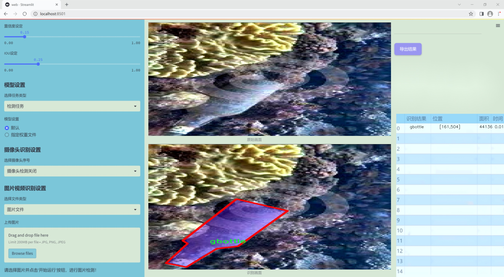
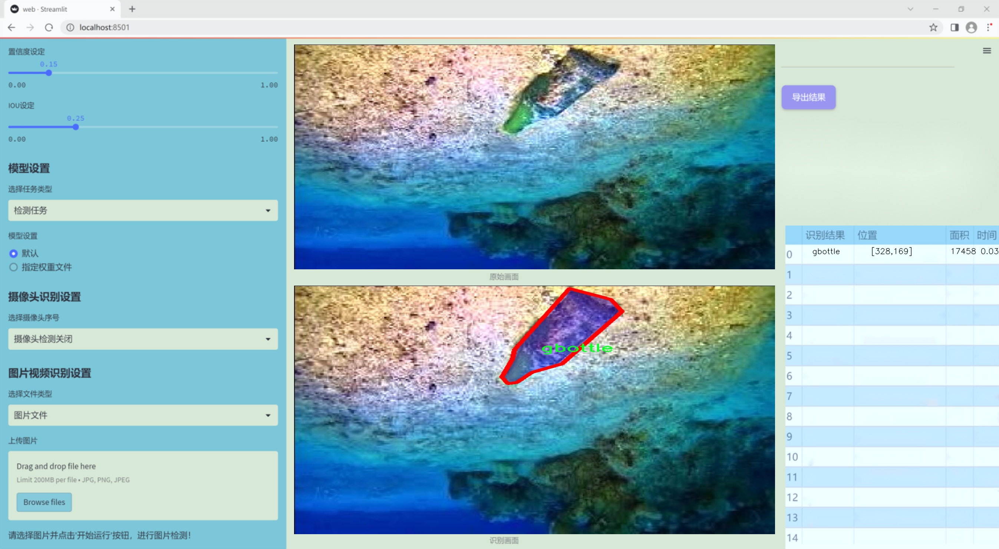
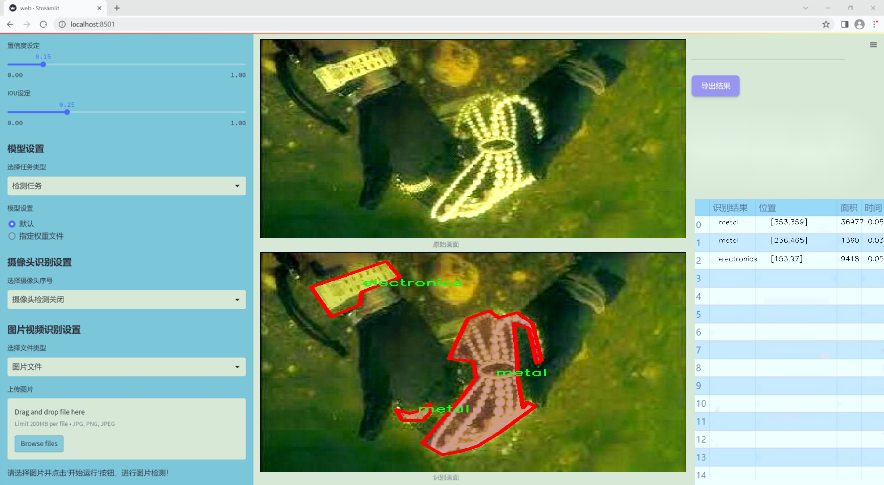
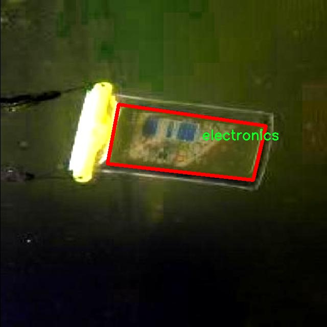
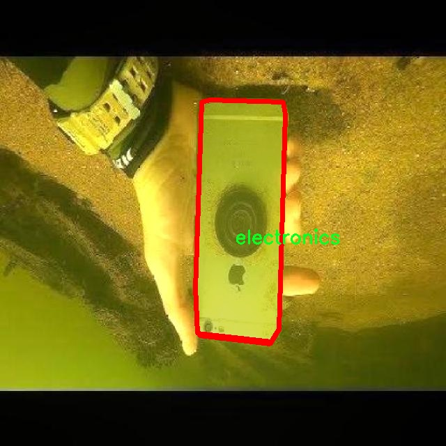
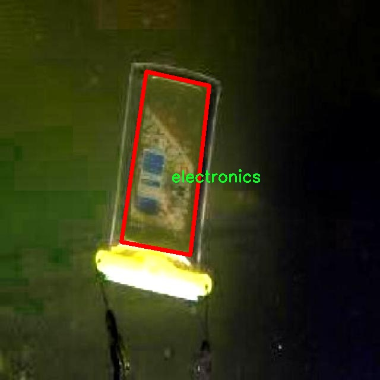
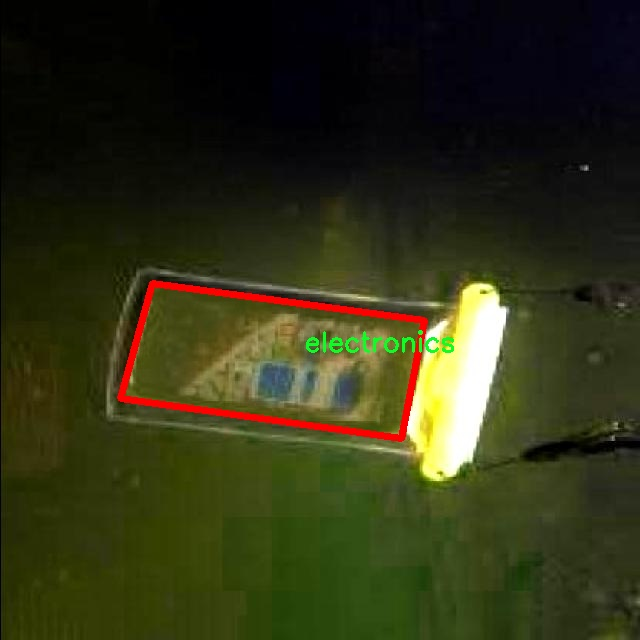

### 1.背景意义

研究背景与意义

随着全球经济的快速发展和城市化进程的加快，海洋和水体污染问题日益严重，尤其是海底垃圾的堆积，已成为影响生态环境和海洋生物多样性的重要因素。海底垃圾不仅对海洋生物造成直接威胁，还可能通过食物链影响人类健康。因此，开展海底垃圾的分类检测与管理工作显得尤为重要。传统的海底垃圾检测方法多依赖人工调查和目视识别，效率低下且易受主观因素影响，难以满足现代环境保护的需求。

近年来，计算机视觉技术的迅猛发展为海底垃圾检测提供了新的解决方案。基于深度学习的目标检测和图像分割技术，尤其是YOLO（You Only Look Once）系列模型，因其高效的实时检测能力而受到广泛关注。YOLOv11作为该系列的最新版本，具备更强的特征提取能力和更高的检测精度，能够在复杂的水下环境中有效识别和分类多种类型的垃圾。

本研究旨在基于改进的YOLOv11模型，构建一个海底水下垃圾分类检测图像分割系统。该系统将利用包含1400幅图像的多类别数据集，涵盖电子产品、塑料瓶、金属等七种垃圾类型，进行实例分割和分类。通过对数据集的深度学习训练，期望实现对海底垃圾的高效识别与分类，从而为海洋环境保护提供科学依据和技术支持。

本项目的实施不仅有助于提升海底垃圾检测的自动化水平，还能为后续的垃圾清理和管理提供数据支持，推动海洋生态环境的可持续发展。通过对海底垃圾的精确监测与分类，能够更好地制定相应的环境保护政策，促进公众对海洋保护的关注与参与，最终实现人与自然的和谐共生。

### 2.视频效果

[2.1 视频效果](https://www.bilibili.com/video/BV1aKqjYeEGh/)

### 3.图片效果







##### [项目涉及的源码数据来源链接](https://kdocs.cn/l/cszuIiCKVNis)**

注意：本项目提供训练的数据集和训练教程,由于版本持续更新,暂不提供权重文件（best.pt）,请按照6.训练教程进行训练后实现上图演示的效果。

### 4.数据集信息

##### 4.1 本项目数据集类别数＆类别名

nc: 7
names: ['electronics', 'gbottle', 'mask', 'metal', 'pbag', 'pbottle', 'waste']


该项目为【图像分割】数据集，请在【训练教程和Web端加载模型教程（第三步）】这一步的时候按照【图像分割】部分的教程来训练

##### 4.2 本项目数据集信息介绍

本项目数据集信息介绍

本项目所使用的数据集专注于海底水下垃圾的分类与检测，旨在通过改进YOLOv11模型，提升图像分割系统在海洋环境中的应用效果。数据集的主题为“bendib”，它涵盖了多种常见的水下垃圾类型，具有重要的环境保护和生态监测意义。该数据集包含七个类别，具体包括电子产品（electronics）、玻璃瓶（gbottle）、口罩（mask）、金属物品（metal）、塑料袋（pbag）、塑料瓶（pbottle）以及其他废弃物（waste）。这些类别的选择反映了当今海洋环境中普遍存在的污染物，尤其是在城市化和工业化加速的背景下，海洋垃圾问题日益严重。

在数据集的构建过程中，研究团队收集了大量的水下图像，确保每个类别的样本数量均衡，以便为YOLOv11模型的训练提供充分的多样性和代表性。这些图像不仅包括不同种类的垃圾，还涵盖了多种水下环境条件，如光照变化、不同水深以及水流的影响等，旨在增强模型的鲁棒性和适应性。通过精细标注每个类别的边界框和分割区域，数据集为模型的训练提供了高质量的监督信号。

此外，为了确保数据集的实用性和有效性，研究团队还进行了数据增强处理，包括旋转、缩放、翻转等操作，以增加样本的多样性并减少过拟合的风险。这一系列的准备工作为改进YOLOv11模型在海底水下垃圾分类检测中的应用奠定了坚实的基础，期待通过这一项目能够为海洋保护和环境治理提供有效的技术支持。










### 5.全套项目环境部署视频教程（零基础手把手教学）

[5.1 所需软件PyCharm和Anaconda安装教程（第一步）](https://www.bilibili.com/video/BV1BoC1YCEKi/?spm_id_from=333.999.0.0&vd_source=bc9aec86d164b67a7004b996143742dc)


[5.2 安装Python虚拟环境创建和依赖库安装视频教程（第二步）](https://www.bilibili.com/video/BV1ZoC1YCEBw?spm_id_from=333.788.videopod.sections&vd_source=bc9aec86d164b67a7004b996143742dc)

### 6.改进YOLOv11训练教程和Web_UI前端加载模型教程（零基础手把手教学）

[6.1 改进YOLOv11训练教程和Web_UI前端加载模型教程（第三步）](https://www.bilibili.com/video/BV1BoC1YCEhR?spm_id_from=333.788.videopod.sections&vd_source=bc9aec86d164b67a7004b996143742dc)


按照上面的训练视频教程链接加载项目提供的数据集，运行train.py即可开始训练



     Epoch   gpu_mem       box       obj       cls    labels  img_size
     1/200     20.8G   0.01576   0.01955  0.007536        22      1280: 100%|██████████| 849/849 [14:42<00:00,  1.04s/it]
               Class     Images     Labels          P          R     mAP@.5 mAP@.5:.95: 100%|██████████| 213/213 [01:14<00:00,  2.87it/s]
                 all       3395      17314      0.994      0.957      0.0957      0.0843

     Epoch   gpu_mem       box       obj       cls    labels  img_size
     2/200     20.8G   0.01578   0.01923  0.007006        22      1280: 100%|██████████| 849/849 [14:44<00:00,  1.04s/it]
               Class     Images     Labels          P          R     mAP@.5 mAP@.5:.95: 100%|██████████| 213/213 [01:12<00:00,  2.95it/s]
                 all       3395      17314      0.996      0.956      0.0957      0.0845

     Epoch   gpu_mem       box       obj       cls    labels  img_size
     3/200     20.8G   0.01561    0.0191  0.006895        27      1280: 100%|██████████| 849/849 [10:56<00:00,  1.29it/s]
               Class     Images     Labels          P          R     mAP@.5 mAP@.5:.95: 100%|███████   | 187/213 [00:52<00:00,  4.04it/s]
                 all       3395      17314      0.996      0.957      0.0957      0.0845


###### [项目数据集下载链接](https://kdocs.cn/l/cszuIiCKVNis)

### 7.原始YOLOv11算法讲解


##### YOLO11介绍

Ultralytics YOLO11是一款尖端的、最先进的模型，它在之前YOLO版本成功的基础上进行了构建，并引入了新功能和改进，以进一步提升性能和灵活性。
**YOLO11设计快速、准确且易于使用，使其成为各种物体检测和跟踪、实例分割、图像分类以及姿态估计任务的绝佳选择。**


**结构图如下：**


##### **C3k2**

**C3k2，结构图如下**


**C3k2，继承自类`C2f，其中通过c3k设置False或者Ture来决定选择使用C3k还是`**Bottleneck


**实现代码** **ultralytics/nn/modules/block.py**

##### C2PSA介绍

**借鉴V10 PSA结构，实现了C2PSA和C2fPSA，最终选择了基于C2的C2PSA（可能涨点更好？）**


**实现代码** **ultralytics/nn/modules/block.py**

##### Detect介绍

**分类检测头引入了DWConv（更加轻量级，为后续二次创新提供了改进点），结构图如下（和V8的区别）：**


### 8.200+种全套改进YOLOV11创新点原理讲解

#### 8.1 200+种全套改进YOLOV11创新点原理讲解大全

由于篇幅限制，每个创新点的具体原理讲解就不全部展开，具体见下列网址中的改进模块对应项目的技术原理博客网址【Blog】（创新点均为模块化搭建，原理适配YOLOv5~YOLOv11等各种版本）

[改进模块技术原理博客【Blog】网址链接](https://gitee.com/qunmasj/good)


#### 8.2 精选部分改进YOLOV11创新点原理讲解

###### 这里节选部分改进创新点展开原理讲解(完整的改进原理见上图和[改进模块技术原理博客链接](https://gitee.com/qunmasj/good)【如果此小节的图加载失败可以通过CSDN或者Github搜索该博客的标题访问原始博客，原始博客图片显示正常】

### RCS-OSA的基本原理
参考该博客，RCSOSA（RCS-One-Shot Aggregation）是RCS-YOLO中提出的一种结构，我们可以将主要原理概括如下：

1. RCS（Reparameterized Convolution based on channel Shuffle）: 结合了通道混洗，通过重参数化卷积来增强网络的特征提取能力。

2. RCS模块: 在训练阶段，利用多分支结构学习丰富的特征表示；在推理阶段，通过结构化重参数化简化为单一分支，减少内存消耗。

3. OSA（One-Shot Aggregation）: 一次性聚合多个特征级联，减少网络计算负担，提高计算效率。

4. 特征级联: RCS-OSA模块通过堆叠RCS，确保特征的复用并加强不同层之间的信息流动。

#### RCS
RCS（基于通道Shuffle的重参数化卷积）是RCS-YOLO的核心组成部分，旨在训练阶段通过多分支结构学习丰富的特征信息，并在推理阶段通过简化为单分支结构来减少内存消耗，实现快速推理。此外，RCS利用通道分割和通道Shuffle操作来降低计算复杂性，同时保持通道间的信息交换，这样在推理阶段相比普通的3×3卷积可以减少一半的计算复杂度。通过结构重参数化，RCS能够在训练阶段从输入特征中学习深层表示，并在推理阶段实现快速推理，同时减少内存消耗。

#### RCS模块
RCS（基于通道Shuffle的重参数化卷积）模块中，结构在训练阶段使用多个分支，包括1x1和3x3的卷积，以及一个直接的连接（Identity），用于学习丰富的特征表示。在推理阶段，结构被重参数化成一个单一的3x3卷积，以减少计算复杂性和内存消耗，同时保持训练阶段学到的特征表达能力。这与RCS的设计理念紧密相连，即在不牺牲性能的情况下提高计算效率。


上图为大家展示了RCS的结构，分为训练阶段（a部分）和推理阶段（b部分）。在训练阶段，输入通过通道分割，一部分输入经过RepVGG块，另一部分保持不变。然后通过1x1卷积和3x3卷积处理RepVGG块的输出，与另一部分输入进行通道Shuffle和连接。在推理阶段，原来的多分支结构被简化为一个单一的3x3 RepConv块。这种设计允许在训练时学习复杂特征，在推理时减少计算复杂度。黑色边框的矩形代表特定的模块操作，渐变色的矩形代表张量的特定特征，矩形的宽度代表张量的通道数。 

#### OSA
OSA（One-Shot Aggregation）是一个关键的模块，旨在提高网络在处理密集连接时的效率。OSA模块通过表示具有多个感受野的多样化特征，并在最后的特征映射中仅聚合一次所有特征，从而克服了DenseNet中密集连接的低效率问题。

OSA模块的使用有两个主要目的：

1. 提高特征表示的多样性：OSA通过聚合具有不同感受野的特征来增加网络对于不同尺度的敏感性，这有助于提升模型对不同大小目标的检测能力。

2. 提高效率：通过在网络的最后一部分只进行一次特征聚合，OSA减少了重复的特征计算和存储需求，从而提高了网络的计算和能源效率。

在RCS-YOLO中，OSA模块被进一步与RCS（基于通道Shuffle的重参数化卷积）相结合，形成RCS-OSA模块。这种结合不仅保持了低成本的内存消耗，而且还实现了语义信息的有效提取，对于构建轻量级和大规模的对象检测器尤为重要。

下面我将为大家展示RCS-OSA（One-Shot Aggregation of RCS）的结构。


在RCS-OSA模块中，输入被分为两部分，一部分直接通过，另一部分通过堆叠的RCS模块进行处理。处理后的特征和直接通过的特征在通道混洗（Channel Shuffle）后合并。这种结构设计用于增强模型的特征提取和利用效率，是RCS-YOLO架构中的一个关键组成部分旨在通过一次性聚合来提高模型处理特征的能力，同时保持计算效率。

#### 特征级联
特征级联（feature cascade）是一种技术，通过在网络的一次性聚合（one-shot aggregate）路径上维持有限数量的特征级联来实现的。在RCS-YOLO中，特别是在RCS-OSA（RCS-Based One-Shot Aggregation）模块中，只保留了三个特征级联。

特征级联的目的是为了减轻网络计算负担并降低内存占用。这种方法可以有效地聚合不同层次的特征，提高模型的语义信息提取能力，同时避免了过度复杂化网络结构所带来的低效率和高资源消耗。

下面为大家提供的图像展示的是RCS-YOLO的整体架构，其中包括RCS-OSA模块。RCS-OSA在模型中用于堆叠RCS模块，以确保特征的复用并加强不同层之间的信息流动。图中显示的多层RCS-OSA模块的排列和组合反映了它们如何一起工作以优化特征传递和提高检测性能。


总结：RCS-YOLO主要由RCS-OSA（蓝色模块）和RepVGG（橙色模块）构成。这里的n代表堆叠RCS模块的数量。n_cls代表检测到的对象中的类别数量。图中的IDetect是从YOLOv11中借鉴过来的，表示使用二维卷积神经网络的检测层。这个架构通过堆叠的RCS模块和RepVGG模块，以及两种类型的检测层，实现了对象检测的任务。 


### 9.系统功能展示

图9.1.系统支持检测结果表格显示

  图9.2.系统支持置信度和IOU阈值手动调节

  图9.3.系统支持自定义加载权重文件best.pt(需要你通过步骤5中训练获得)

  图9.4.系统支持摄像头实时识别

  图9.5.系统支持图片识别

  图9.6.系统支持视频识别

  图9.7.系统支持识别结果文件自动保存

  图9.8.系统支持Excel导出检测结果数据


### 10. YOLOv11核心改进源码讲解

#### 10.1 kaln_conv.py

以下是对代码的核心部分进行分析和详细注释的结果：

```python
from functools import lru_cache
import torch
import torch.nn as nn
from torch.nn.functional import conv3d, conv2d, conv1d

class KALNConvNDLayer(nn.Module):
    def __init__(self, conv_class, norm_class, conv_w_fun, input_dim, output_dim, degree, kernel_size,
                 groups=1, padding=0, stride=1, dilation=1, dropout: float = 0.0, ndim: int = 2):
        super(KALNConvNDLayer, self).__init__()
        
        # 初始化参数
        self.inputdim = input_dim  # 输入维度
        self.outdim = output_dim    # 输出维度
        self.degree = degree         # 多项式的阶数
        self.kernel_size = kernel_size  # 卷积核大小
        self.padding = padding       # 填充
        self.stride = stride         # 步幅
        self.dilation = dilation     # 膨胀
        self.groups = groups         # 分组卷积的组数
        self.base_activation = nn.SiLU()  # 基础激活函数
        self.conv_w_fun = conv_w_fun  # 卷积权重函数
        self.ndim = ndim             # 数据的维度（1D, 2D, 3D）
        self.dropout = None          # Dropout层

        # 初始化Dropout层
        if dropout > 0:
            if ndim == 1:
                self.dropout = nn.Dropout1d(p=dropout)
            elif ndim == 2:
                self.dropout = nn.Dropout2d(p=dropout)
            elif ndim == 3:
                self.dropout = nn.Dropout3d(p=dropout)

        # 检查分组参数的有效性
        if groups <= 0:
            raise ValueError('groups must be a positive integer')
        if input_dim % groups != 0:
            raise ValueError('input_dim must be divisible by groups')
        if output_dim % groups != 0:
            raise ValueError('output_dim must be divisible by groups')

        # 创建基础卷积层和归一化层
        self.base_conv = nn.ModuleList([conv_class(input_dim // groups,
                                                   output_dim // groups,
                                                   kernel_size,
                                                   stride,
                                                   padding,
                                                   dilation,
                                                   groups=1,
                                                   bias=False) for _ in range(groups)])

        self.layer_norm = nn.ModuleList([norm_class(output_dim // groups) for _ in range(groups)])

        # 多项式权重的形状
        poly_shape = (groups, output_dim // groups, (input_dim // groups) * (degree + 1)) + tuple(
            kernel_size for _ in range(ndim))

        # 初始化多项式权重
        self.poly_weights = nn.Parameter(torch.randn(*poly_shape))

        # 使用Kaiming均匀分布初始化卷积层和多项式权重
        for conv_layer in self.base_conv:
            nn.init.kaiming_uniform_(conv_layer.weight, nonlinearity='linear')
        nn.init.kaiming_uniform_(self.poly_weights, nonlinearity='linear')

    @lru_cache(maxsize=128)  # 使用LRU缓存避免重复计算勒让德多项式
    def compute_legendre_polynomials(self, x, order):
        # 计算勒让德多项式
        P0 = x.new_ones(x.shape)  # P0 = 1
        if order == 0:
            return P0.unsqueeze(-1)
        P1 = x  # P1 = x
        legendre_polys = [P0, P1]

        # 递归计算高阶多项式
        for n in range(1, order):
            Pn = ((2.0 * n + 1.0) * x * legendre_polys[-1] - n * legendre_polys[-2]) / (n + 1.0)
            legendre_polys.append(Pn)

        return torch.concatenate(legendre_polys, dim=1)

    def forward_kal(self, x, group_index):
        # 前向传播函数
        base_output = self.base_conv[group_index](x)  # 基础卷积输出

        # 将输入归一化到[-1, 1]范围
        x_normalized = 2 * (x - x.min()) / (x.max() - x.min()) - 1 if x.shape[0] > 0 else x

        # 应用Dropout
        if self.dropout is not None:
            x_normalized = self.dropout(x_normalized)

        # 计算勒让德多项式
        legendre_basis = self.compute_legendre_polynomials(x_normalized, self.degree)
        # 使用多项式权重进行卷积
        poly_output = self.conv_w_fun(legendre_basis, self.poly_weights[group_index],
                                      stride=self.stride, dilation=self.dilation,
                                      padding=self.padding, groups=1)

        # 合并基础输出和多项式输出
        x = base_output + poly_output
        # 归一化和激活
        if isinstance(self.layer_norm[group_index], nn.LayerNorm):
            orig_shape = x.shape
            x = self.layer_norm[group_index](x.view(orig_shape[0], -1)).view(orig_shape)
        else:
            x = self.layer_norm[group_index](x)
        x = self.base_activation(x)

        return x

    def forward(self, x):
        # 前向传播函数
        split_x = torch.split(x, self.inputdim // self.groups, dim=1)  # 按组分割输入
        output = []
        for group_ind, _x in enumerate(split_x):
            y = self.forward_kal(_x.clone(), group_ind)  # 对每个组进行前向传播
            output.append(y.clone())
        y = torch.cat(output, dim=1)  # 合并输出
        return y
```

### 代码分析与注释
1. **KALNConvNDLayer 类**：这是一个通用的卷积层类，支持多维卷积（1D、2D、3D），实现了基于勒让德多项式的卷积操作。
2. **初始化方法**：在构造函数中，初始化卷积层、归一化层和多项式权重，并检查输入参数的有效性。
3. **compute_legendre_polynomials 方法**：计算勒让德多项式，使用递归关系生成多项式。
4. **forward_kal 方法**：执行前向传播，处理输入数据并计算基础卷积和多项式卷积的输出。
5. **forward 方法**：对输入进行分组处理，调用 `forward_kal` 方法进行计算，最后合并输出。

以上是对代码的核心部分进行了提炼和详细注释，帮助理解其功能和实现逻辑。

这个文件定义了一个用于卷积神经网络的自定义层，名为 `KALNConvNDLayer`，以及其一维、二维和三维的特化版本 `KALNConv1DLayer`、`KALNConv2DLayer` 和 `KALNConv3DLayer`。该层的设计旨在结合传统卷积操作与多项式特征的提取，以增强模型的表达能力。

首先，`KALNConvNDLayer` 类的构造函数接受多个参数，包括卷积类型、归一化类型、输入和输出维度、卷积核大小、组数、填充、步幅、扩张率、丢弃率以及维度数量。构造函数中进行了一系列参数验证，以确保输入和输出维度能够被组数整除。接着，创建了多个卷积层和归一化层，并初始化了多项式权重，这些权重将用于后续的多项式计算。

该类还定义了一个缓存的函数 `compute_legendre_polynomials`，用于计算勒让德多项式。该函数通过递归关系生成多项式，支持多项式的阶数计算，且使用了 `lru_cache` 来避免重复计算，提高效率。

在前向传播方法 `forward_kal` 中，首先对输入进行基础卷积操作，然后对输入进行归一化处理，以便计算勒让德多项式。接着，使用多项式权重和计算得到的多项式基进行卷积操作，最后将基础卷积输出与多项式输出相加，并进行归一化和激活处理。

`forward` 方法则负责将输入数据分割成多个组，分别通过 `forward_kal` 进行处理，最后将所有组的输出拼接在一起。

对于一维、二维和三维的特化版本，`KALNConv1DLayer`、`KALNConv2DLayer` 和 `KALNConv3DLayer` 类分别调用了 `KALNConvNDLayer` 的构造函数，指定相应的卷积和归一化类型。这使得该层可以灵活地应用于不同维度的数据，适应各种深度学习任务。

总体而言，这个文件实现了一个复杂的卷积层，结合了多项式特征的计算和传统卷积操作，旨在提高神经网络的性能和表达能力。

#### 10.2 rep_block.py

以下是保留的核心代码部分，并附上详细的中文注释：

```python
import torch
import torch.nn as nn
import torch.nn.functional as F

def transI_fusebn(kernel, bn):
    """
    将卷积核和批归一化层的参数融合为一个卷积核和偏置。
    
    参数:
    kernel: 卷积核权重
    bn: 批归一化层
    
    返回:
    融合后的卷积核和偏置
    """
    gamma = bn.weight  # 获取批归一化的缩放因子
    std = (bn.running_var + bn.eps).sqrt()  # 计算标准差
    return kernel * ((gamma / std).reshape(-1, 1, 1, 1)), bn.bias - bn.running_mean * gamma / std

def conv_bn(in_channels, out_channels, kernel_size, stride=1, padding=0, dilation=1, groups=1):
    """
    创建一个卷积层和一个批归一化层的组合。
    
    参数:
    in_channels: 输入通道数
    out_channels: 输出通道数
    kernel_size: 卷积核大小
    stride: 步幅
    padding: 填充
    dilation: 膨胀
    groups: 分组卷积的组数
    
    返回:
    包含卷积层和批归一化层的顺序容器
    """
    conv_layer = nn.Conv2d(in_channels=in_channels, out_channels=out_channels, kernel_size=kernel_size,
                           stride=stride, padding=padding, dilation=dilation, groups=groups,
                           bias=False)  # 创建卷积层，不使用偏置
    bn_layer = nn.BatchNorm2d(num_features=out_channels, affine=True)  # 创建批归一化层
    return nn.Sequential(conv_layer, bn_layer)  # 返回顺序容器

class DiverseBranchBlock(nn.Module):
    """
    多分支块，包含多个卷积分支和融合机制。
    """
    def __init__(self, in_channels, out_channels, kernel_size, stride=1, padding=None, dilation=1, groups=1):
        super(DiverseBranchBlock, self).__init__()
        
        if padding is None:
            padding = kernel_size // 2  # 默认填充为卷积核大小的一半
        
        # 定义主要的卷积和批归一化组合
        self.dbb_origin = conv_bn(in_channels=in_channels, out_channels=out_channels, kernel_size=kernel_size,
                                  stride=stride, padding=padding, dilation=dilation, groups=groups)

        # 定义平均池化分支
        self.dbb_avg = nn.Sequential(
            nn.Conv2d(in_channels=in_channels, out_channels=out_channels, kernel_size=1, stride=1, padding=0, groups=groups, bias=False),
            nn.BatchNorm2d(out_channels),
            nn.AvgPool2d(kernel_size=kernel_size, stride=stride, padding=0)
        )

    def forward(self, inputs):
        """
        前向传播，计算输出。
        
        参数:
        inputs: 输入张量
        
        返回:
        输出张量
        """
        out = self.dbb_origin(inputs)  # 通过主要的卷积分支
        out += self.dbb_avg(inputs)  # 加上平均池化分支的输出
        return out  # 返回最终输出

# 这里可以继续添加其他类或函数，具体根据需要保留的功能而定
```

以上代码展示了一个核心的多分支卷积块的实现，包含了卷积层和批归一化层的组合，以及前向传播的逻辑。每个函数和类都附有详细的中文注释，解释其功能和参数。

这个程序文件 `rep_block.py` 定义了一些深度学习中使用的模块，主要是针对卷积神经网络（CNN）中的多分支卷积块（Diverse Branch Block）进行实现。代码中使用了 PyTorch 框架，包含了多个类和函数，主要功能是实现不同类型的卷积操作和批归一化（Batch Normalization）。

首先，文件导入了必要的库，包括 `torch` 和 `torch.nn`，以及一些自定义的模块。然后定义了一些辅助函数，例如 `transI_fusebn` 用于将卷积层和批归一化层的权重和偏置融合，`transII_addbranch` 用于将多个卷积的输出相加，`transIII_1x1_kxk` 用于处理不同卷积核的组合，`transIV_depthconcat` 用于将多个卷积核的输出在深度维度上进行拼接，`transV_avg` 用于生成平均池化的卷积核，`transVI_multiscale` 用于对卷积核进行多尺度处理。

接下来，定义了几个类，主要包括 `IdentityBasedConv1x1`、`BNAndPadLayer`、`DiverseBranchBlock`、`DiverseBranchBlockNOAct`、`DeepDiverseBranchBlock` 和 `WideDiverseBranchBlock`。这些类的主要功能如下：

- `IdentityBasedConv1x1` 类实现了一个带有身份映射的 1x1 卷积层，能够在卷积操作中保留输入特征的某些信息。
- `BNAndPadLayer` 类结合了批归一化和填充操作，能够在进行卷积时保持特征图的尺寸一致。
- `DiverseBranchBlock` 类实现了一个多分支卷积块，能够根据输入的通道数和卷积核大小灵活地组合不同的卷积操作，支持多种初始化方式和部署模式。
- `DiverseBranchBlockNOAct` 类与 `DiverseBranchBlock` 类类似，但不包含激活函数的操作。
- `DeepDiverseBranchBlock` 类在 `DiverseBranchBlock` 的基础上进行了扩展，增加了更多的卷积分支和功能。
- `WideDiverseBranchBlock` 类则实现了宽卷积块，能够处理不同形状的卷积核，并在卷积操作中引入了水平和垂直卷积的组合。

这些类的设计允许在卷积神经网络中实现更复杂的结构，能够有效地提取特征并提高模型的表现。每个类中都包含了前向传播的方法 `forward`，用于定义输入数据如何通过网络进行处理，并返回输出结果。

总体来说，这个文件实现了多种卷积操作的组合和融合，提供了灵活的模块化设计，适用于构建复杂的深度学习模型。

#### 10.3 test_selective_scan_easy.py

以下是代码中最核心的部分，并附上详细的中文注释：

```python
import torch
import torch.nn.functional as F

def selective_scan_easy(us, dts, As, Bs, Cs, Ds, delta_bias=None, delta_softplus=False, return_last_state=False, chunksize=64):
    """
    选择性扫描函数，进行状态更新和输出计算。
    
    参数：
    us: 输入张量，形状为 (B, G * D, L)
    dts: 时间增量张量，形状为 (B, G * D, L)
    As: 系数矩阵，形状为 (G * D, N)
    Bs: 权重张量，形状为 (B, G, N, L)
    Cs: 输出权重张量，形状为 (B, G, N, L)
    Ds: 偏置项，形状为 (G * D)
    delta_bias: 可选的偏置调整，形状为 (G * D)
    delta_softplus: 是否应用softplus函数
    return_last_state: 是否返回最后的状态
    chunksize: 每次处理的块大小
    """
    
    def selective_scan_chunk(us, dts, As, Bs, Cs, hprefix):
        """
        处理单个块的选择性扫描。
        
        参数：
        us: 输入张量块
        dts: 时间增量张量块
        As: 系数矩阵
        Bs: 权重张量块
        Cs: 输出权重张量块
        hprefix: 前一个状态
        
        返回：
        ys: 输出张量
        hs: 状态张量
        """
        ts = dts.cumsum(dim=0)  # 计算时间增量的累积和
        Ats = torch.einsum("gdn,lbgd->lbgdn", As, ts).exp()  # 计算系数矩阵的指数
        scale = 1  # 缩放因子
        rAts = Ats / scale  # 归一化的系数矩阵
        duts = dts * us  # 计算增量的输入
        dtBus = torch.einsum("lbgd,lbgn->lbgdn", duts, Bs)  # 计算增量的权重
        hs_tmp = rAts * (dtBus / rAts).cumsum(dim=0)  # 计算状态
        hs = hs_tmp + Ats * hprefix.unsqueeze(0)  # 更新状态
        ys = torch.einsum("lbgn,lbgdn->lbgd", Cs, hs)  # 计算输出
        return ys, hs

    # 数据类型设置
    dtype = torch.float32
    inp_dtype = us.dtype  # 输入数据类型
    has_D = Ds is not None  # 检查是否有偏置项
    if chunksize < 1:
        chunksize = Bs.shape[-1]  # 设置块大小

    # 处理输入数据
    dts = dts.to(dtype)
    if delta_bias is not None:
        dts = dts + delta_bias.view(1, -1, 1).to(dtype)  # 应用偏置调整
    if delta_softplus:
        dts = F.softplus(dts)  # 应用softplus函数

    # 处理张量维度
    Bs = Bs.unsqueeze(1) if len(Bs.shape) == 3 else Bs
    Cs = Cs.unsqueeze(1) if len(Cs.shape) == 3 else Cs
    B, G, N, L = Bs.shape
    us = us.view(B, G, -1, L).permute(3, 0, 1, 2).to(dtype)
    dts = dts.view(B, G, -1, L).permute(3, 0, 1, 2).to(dtype)
    As = As.view(G, -1, N).to(dtype)
    Bs = Bs.permute(3, 0, 1, 2).to(dtype)
    Cs = Cs.permute(3, 0, 1, 2).to(dtype)
    Ds = Ds.view(G, -1).to(dtype) if has_D else None
    D = As.shape[1]  # 状态维度

    oys = []  # 输出列表
    hprefix = us.new_zeros((B, G, D, N), dtype=dtype)  # 初始化前一个状态
    for i in range(0, L, chunksize):
        ys, hs = selective_scan_chunk(
            us[i:i + chunksize], dts[i:i + chunksize], 
            As, Bs[i:i + chunksize], Cs[i:i + chunksize], hprefix, 
        )
        oys.append(ys)  # 添加输出
        hprefix = hs[-1]  # 更新前一个状态

    oys = torch.cat(oys, dim=0)  # 合并输出
    if has_D:
        oys = oys + Ds * us  # 应用偏置项
    oys = oys.permute(1, 2, 3, 0).view(B, -1, L)  # 调整输出维度

    return oys.to(inp_dtype) if not return_last_state else (oys.to(inp_dtype), hprefix.view(B, G * D, N).float())
```

### 代码核心部分说明：
1. **selective_scan_easy**：主函数，接收输入数据和参数，进行选择性扫描。
2. **selective_scan_chunk**：处理单个数据块的函数，计算状态和输出。
3. **张量处理**：包括输入数据的维度调整、类型转换、偏置应用等。
4. **输出合并**：将多个块的输出合并为最终结果，并处理偏置项。

以上是代码的核心部分及其详细注释，帮助理解选择性扫描的实现逻辑。

这个程序文件 `test_selective_scan_easy.py` 是一个用于实现和测试选择性扫描（Selective Scan）算法的 PyTorch 代码。选择性扫描是一种用于处理序列数据的技术，常用于深度学习中的时间序列预测、序列建模等任务。以下是对代码的详细说明。

首先，代码导入了一些必要的库，包括 `math`、`functools`、`torch`、`torch.nn.functional`、`pytest` 和 `einops`。这些库提供了数学运算、函数式编程、张量操作和测试功能。

接下来，定义了一个名为 `selective_scan_easy` 的函数，该函数实现了选择性扫描的核心逻辑。函数的输入包括多个张量，如 `us`、`dts`、`As`、`Bs`、`Cs` 和 `Ds`，这些张量代表了输入数据、时间差、参数矩阵等。函数内部定义了一个名为 `selective_scan_chunk` 的嵌套函数，用于处理数据块的选择性扫描。

在 `selective_scan_chunk` 函数中，使用了张量运算来计算状态和输出。通过对输入数据进行累加和矩阵乘法，计算出当前时间步的状态和输出。函数的返回值是当前时间步的输出和状态。

在 `selective_scan_easy` 函数中，首先对输入数据进行类型转换和形状调整，然后通过循环处理每个数据块，调用 `selective_scan_chunk` 函数进行计算。最终，函数返回计算得到的输出和最后的状态。

接下来，定义了一个名为 `SelectiveScanEasy` 的类，继承自 `torch.autograd.Function`，用于实现自定义的前向和反向传播。类中定义了 `forward` 和 `backward` 静态方法，分别用于计算前向传播和反向传播的梯度。前向传播中调用了 `selective_scan_easy` 函数，而反向传播则通过保存的张量计算梯度。

此外，代码还定义了一些其他的选择性扫描变体函数，如 `selective_scan_easyv2` 和 `selective_scan_easyv3`，这些函数实现了不同的选择性扫描逻辑，可能用于不同的应用场景或优化。

最后，代码中包含了一个测试函数 `test_selective_scan`，使用 `pytest` 框架对选择性扫描的实现进行单元测试。测试中使用了多种参数组合，验证了选择性扫描函数的正确性和性能。

总体而言，这个程序文件实现了选择性扫描算法的核心逻辑，并提供了多种变体和测试用例，适用于深度学习中的序列数据处理任务。

#### 10.4 shiftwise_conv.py

以下是经过简化和详细注释的核心代码部分：

```python
import math
import torch
import torch.nn as nn
import torch.nn.functional as F

def get_conv2d(in_channels, out_channels, kernel_size, stride, padding, dilation, groups, bias):
    """
    创建一个2D卷积层
    """
    return nn.Conv2d(
        in_channels, out_channels, kernel_size, stride, padding, dilation, groups, bias
    )

def get_bn(channels):
    """
    创建一个批归一化层
    """
    return nn.BatchNorm2d(channels)

class Mask(nn.Module):
    """
    定义一个Mask类，用于生成可学习的权重掩码
    """
    def __init__(self, size):
        super().__init__()
        # 初始化权重参数，范围在[-1, 1]之间
        self.weight = torch.nn.Parameter(data=torch.Tensor(*size), requires_grad=True)
        self.weight.data.uniform_(-1, 1)

    def forward(self, x):
        # 应用sigmoid激活函数，生成掩码权重
        w = torch.sigmoid(self.weight)
        masked_wt = w.mul(x)  # 将输入x与掩码权重相乘
        return masked_wt

class ReparamLargeKernelConv(nn.Module):
    """
    定义一个重参数化的大卷积核层
    """
    def __init__(self, in_channels, out_channels, kernel_size, small_kernel=5, stride=1, groups=1, small_kernel_merged=False, Decom=True, bn=True):
        super(ReparamLargeKernelConv, self).__init__()
        self.kernel_size = kernel_size
        self.small_kernel = small_kernel
        self.Decom = Decom
        padding = kernel_size // 2  # 计算填充大小

        # 根据是否合并小卷积核来选择不同的卷积层
        if small_kernel_merged:
            self.lkb_reparam = get_conv2d(
                in_channels=in_channels,
                out_channels=out_channels,
                kernel_size=kernel_size,
                stride=stride,
                padding=padding,
                dilation=1,
                groups=groups,
                bias=True,
            )
        else:
            if self.Decom:
                self.LoRA = conv_bn(
                    in_channels=in_channels,
                    out_channels=out_channels,
                    kernel_size=(kernel_size, small_kernel),
                    stride=stride,
                    padding=padding,
                    dilation=1,
                    groups=groups,
                    bn=bn
                )
            else:
                self.lkb_origin = conv_bn(
                    in_channels=in_channels,
                    out_channels=out_channels,
                    kernel_size=kernel_size,
                    stride=stride,
                    padding=padding,
                    dilation=1,
                    groups=groups,
                    bn=bn,
                )

            if (small_kernel is not None) and small_kernel < kernel_size:
                self.small_conv = conv_bn(
                    in_channels=in_channels,
                    out_channels=out_channels,
                    kernel_size=small_kernel,
                    stride=stride,
                    padding=small_kernel // 2,
                    groups=groups,
                    dilation=1,
                    bn=bn,
                )
        
        self.bn = get_bn(out_channels)  # 批归一化层
        self.act = nn.SiLU()  # 激活函数

    def forward(self, inputs):
        """
        前向传播函数
        """
        if hasattr(self, "lkb_reparam"):
            out = self.lkb_reparam(inputs)  # 使用重参数化卷积
        elif self.Decom:
            out = self.LoRA(inputs)  # 使用LoRA卷积
            if hasattr(self, "small_conv"):
                out += self.small_conv(inputs)  # 加上小卷积的输出
        else:
            out = self.lkb_origin(inputs)  # 使用原始卷积
            if hasattr(self, "small_conv"):
                out += self.small_conv(inputs)  # 加上小卷积的输出
        return self.act(self.bn(out))  # 返回经过激活和归一化的输出

    def get_equivalent_kernel_bias(self):
        """
        获取等效的卷积核和偏置
        """
        eq_k, eq_b = fuse_bn(self.lkb_origin.conv, self.lkb_origin.bn)  # 融合卷积和批归一化
        if hasattr(self, "small_conv"):
            small_k, small_b = fuse_bn(self.small_conv.conv, self.small_conv.bn)
            eq_b += small_b  # 加上小卷积的偏置
            eq_k += nn.functional.pad(small_k, [(self.kernel_size - self.small_kernel) // 2] * 4)  # 填充小卷积核
        return eq_k, eq_b  # 返回等效卷积核和偏置

    def switch_to_deploy(self):
        """
        切换到部署模式
        """
        if hasattr(self, 'lkb_origin'):
            eq_k, eq_b = self.get_equivalent_kernel_bias()  # 获取等效卷积核和偏置
            self.lkb_reparam = get_conv2d(
                in_channels=self.lkb_origin.conv.in_channels,
                out_channels=self.lkb_origin.conv.out_channels,
                kernel_size=self.lkb_origin.conv.kernel_size,
                stride=self.lkb_origin.conv.stride,
                padding=self.lkb_origin.conv.padding,
                dilation=self.lkb_origin.conv.dilation,
                groups=self.lkb_origin.conv.groups,
                bias=True,
            )
            self.lkb_reparam.weight.data = eq_k  # 设置等效卷积核权重
            self.lkb_reparam.bias.data = eq_b  # 设置等效偏置
            self.__delattr__("lkb_origin")  # 删除原始卷积属性
            if hasattr(self, "small_conv"):
                self.__delattr__("small_conv")  # 删除小卷积属性
```

### 代码核心部分说明：
1. **卷积和批归一化的创建**：`get_conv2d`和`get_bn`函数用于创建卷积层和批归一化层。
2. **Mask类**：用于生成可学习的权重掩码，应用于输入数据。
3. **ReparamLargeKernelConv类**：实现了重参数化的大卷积核层，支持小卷积核的合并与分解。
4. **前向传播**：在`forward`方法中实现了不同卷积层的调用和输出的组合。
5. **等效卷积核和偏置的获取**：`get_equivalent_kernel_bias`方法用于计算卷积层的等效卷积核和偏置，以便在部署时使用。
6. **切换到部署模式**：`switch_to_deploy`方法用于将模型切换到部署模式，减少计算开销。

这个程序文件 `shiftwise_conv.py` 定义了一个用于实现大核卷积的深度学习模块，主要包含了几种卷积操作和相关的功能。文件中使用了 PyTorch 框架，主要涉及到卷积层、批归一化层以及一些自定义的操作。

首先，文件中定义了一些辅助函数，比如 `get_conv2d` 和 `get_bn`，用于创建卷积层和批归一化层。`get_conv2d` 函数根据输入参数创建一个 `nn.Conv2d` 对象，并处理可能的填充参数。`get_bn` 函数则创建一个 `nn.BatchNorm2d` 对象。

接下来，定义了一个 `Mask` 类，它是一个自定义的模块，包含一个可学习的权重参数。这个权重通过 Sigmoid 函数进行激活，并与输入相乘，形成一个掩码效果。

`conv_bn_ori` 函数用于创建一个包含卷积层和可选的批归一化层的序列。它根据输入参数配置卷积层的属性，并在需要时添加批归一化层。

`LoRAConvsByWeight` 类实现了一种特殊的卷积操作，它结合了大核和小核的卷积，通过权重的方式进行通道的重排。这个类的构造函数接收多个参数，初始化卷积层和掩码，并根据需要添加批归一化层。在 `forward` 方法中，首先通过小卷积层处理输入，然后通过 `forward_lora` 方法处理输出，最终将两个结果相加。

`forward_lora` 方法负责处理卷积输出的重排和归一化。它通过 `rearrange_data` 方法根据指定的方向（水平或垂直）对输出进行重排，并根据需要添加填充。

`rearrange_data` 方法根据卷积的参数计算新的填充，并调整输出的维度，以确保卷积操作的有效性。

`shift` 方法用于计算填充和窗口的索引，确保卷积操作不改变特征图的大小。

`conv_bn` 函数根据输入的卷积核大小决定使用哪种卷积操作，如果是单一卷积核，则调用 `conv_bn_ori`，如果是大核和小核的组合，则调用 `LoRAConvsByWeight`。

`fuse_bn` 函数用于将卷积层和批归一化层融合，返回融合后的卷积核和偏置。

最后，`ReparamLargeKernelConv` 类是主要的卷积模块，它支持大核卷积和小核卷积的组合。构造函数中根据输入参数初始化卷积层和批归一化层，并在 `forward` 方法中执行前向传播。该类还提供了 `get_equivalent_kernel_bias` 方法用于获取等效的卷积核和偏置，以及 `switch_to_deploy` 方法用于在部署时转换为可直接使用的卷积层。

整体而言，这个文件实现了一个灵活且高效的卷积操作模块，支持多种卷积核的组合和处理，适用于深度学习中的图像处理任务。

### 11.完整训练+Web前端界面+200+种全套创新点源码、数据集获取


# [下载链接：https://mbd.pub/o/bread/Z5yYk59u](https://mbd.pub/o/bread/Z5yYk59u)